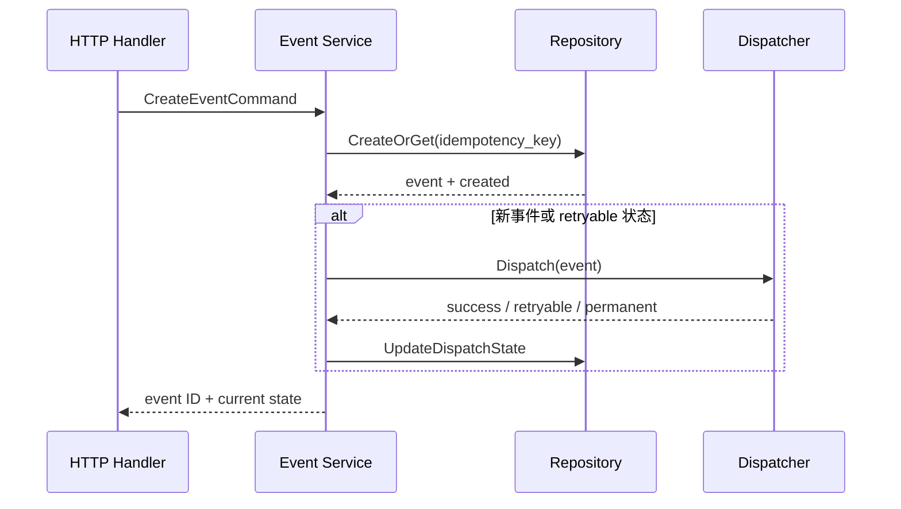

# ExecPlan: Webhook Ingest 幂等与重试升级

## Goal

- 目标：同一 webhook 重复到达时只产生一条事件记录；临时派发失败可以安全重试。
- 成功标准：重复请求返回同一 event ID，失败状态可恢复，现有签名校验与同步响应语义不变。

## Scope and Non-Goals

- Included：HTTP 入口、事件 service、event repository、派发重试测试与 runbook。
- Excluded：更换消息队列、重写签名协议、历史数据回填和生产发布。

## Scope Freeze

| 类型 | 内容 |
| --- | --- |
| Write scope | `internal/webhook/**`、`internal/event/**`、相关测试与 runbook |
| Acceptance Matrix | 重复请求、首次成功、临时失败重试、永久失败停止 |
| Stop When | 需要 schema 破坏性变更或触达生产数据时停止确认 |

## Context and Orientation

- HTTP handler 当前验签后直接调用 `EventService.CreateAndDispatch`。
- repository 已有事务接口，但事件表没有稳定幂等键查询方法。
- 派发器会返回 retryable / permanent 两类错误；本次复用该分类。
- 风险是并发重复请求和“记录已写入、派发未完成”的中间状态。

## 0. 现有架构回顾与核心设计决策

### 真实入口与触发

- `调用者 / 入口`：第三方系统向 `POST /webhooks/events` 发送签名请求。
- `入口代码位置`：`internal/webhook/http_handler.go::HandleEvent`。
- `触发条件 / 上游依赖`：签名、时间窗和 payload schema 校验通过后进入事件 service。

### 输入装配与边界校验

- `输入来源与装配位置`：handler 将 header、provider 和 payload 装配为 `CreateEventCommand`。
- `装配结果 / 核心对象`：`CreateEventCommand{Provider, ExternalID, PayloadHash, Payload}`。
- `边界校验 / 拒绝条件`：缺少 external ID、签名失败、时间窗过期或同一 ID 对应不同 payload 时直接拒绝。

### 组件职责与代码落点

| 模块/类型 | 新增/复用 | 关键产物 | 职责 | 不负责 |
| --- | --- | --- | --- | --- |
| `internal/webhook/http_handler.go` | 复用 | `CreateEventCommand` | 验签、装配和 HTTP 映射 | 不做幂等判断 |
| `internal/event/service.go` | 修改 | `CreateOrGet` 流程 | 决定新建、复用、派发或停止 | 不直接写 SQL |
| `internal/event/repository.go` | 修改 | `FindByIdempotencyKey` | 事务内查询和持久化事件状态 | 不分类派发错误 |

### 关键执行时序



- `步骤化时序`：
  1. handler 校验并构造 command，不在入口层访问 repository。
  2. service 根据 `provider + external_id` 计算幂等键，在事务中 CreateOrGet。
  3. 已成功事件直接返回；新事件或 retryable 事件进入 dispatcher。
  4. service 按错误分类写入 dispatched、retryable 或 failed 状态，再返回稳定 event ID。

### 停止 / 错误 / 恢复

- `正常停止条件`：事件已成功派发，或已记录 permanent failure。
- `主要错误出口`：事务失败返回 500；幂等键冲突但 payload 不同返回 409；永久派发失败返回已记录状态。
- `关键分支 / 降级路径`：dispatcher 暂时不可用时保留 retryable 状态，不回滚已持久化事件。
- `恢复 / 重试 / 回滚`：同一请求可安全重放；retry worker 只消费 retryable 状态并使用同一幂等键。

### 按需补充：竞态与状态机

- 唯一约束保护并发 CreateOrGet；冲突后回读已有记录。
- 状态只允许 `pending -> dispatched|retryable|failed`，以及 `retryable -> dispatched|retryable|failed`。
- dispatcher 调用不放在数据库事务内，避免长事务；状态更新失败由同一 event ID 重试恢复。

## 1. HTTP 与 service -- 稳定幂等入口

- handler 复用现有验签与错误映射，只新增 command 装配。
- service 统一计算幂等键并验证同一 external ID 的 payload hash。
- 重复成功事件不再次调用 dispatcher；冲突 payload 明确返回 409。

## 2. Repository 与派发 -- 可恢复状态

- repository 提供事务内 CreateOrGet 和条件状态更新。
- dispatcher 错误沿用现有 retryable 分类，不新增平行错误体系。
- focused tests 覆盖并发重复、临时失败重试和永久失败停止。

## Reference Snippets

```go
type CreateEventCommand struct {
    Provider   string
    ExternalID string
    PayloadHash string
    Payload    []byte
}
```

```text
idempotency_key = sha256(provider + ":" + external_id)
```

- 片段作用：锁定入口对象和跨重试保持不变的稳定键，不复制具体实现。

## Concrete Steps

### 实现步骤

1. 在 handler 装配 command，并保持现有验签、超时和响应映射。
2. 在 repository 增加幂等查询、CreateOrGet 和条件状态更新。
3. 在 service 实现重复返回、冲突拒绝、派发分类和恢复分支。
4. 补并发、重试、永久失败测试及脱敏 runbook 摘要。

### 验证与收口步骤

1. 运行 webhook 与 event focused tests 和 race tests。
2. 运行项目完整 test、lint、Harness gate 与 `git diff --check`。
3. 回写 Issue 的 Acceptance Matrix、验证证据和未执行的 live 项。

## Progress

| 日期 | 状态 | 说明 |
| --- | --- | --- |
| 2026-01-01 | completed | 范围、设计、实现与本地验证完成 |

## Decision Log

| 日期 | 决策 | 原因 |
| --- | --- | --- |
| 2026-01-01 | 幂等键基于 provider + external ID | 上游稳定，且不暴露完整 payload |
| 2026-01-01 | 外部派发不放进 DB 事务 | 避免外部超时扩大事务窗口 |

## Surprises & Discoveries

- 现有 dispatcher 已有稳定错误分类，无需新增 retry policy 类型。

## Validation and Acceptance

- `go test -race ./internal/webhook ./internal/event`
- `make test && make lint && make harness-verify`
- live provider 回放：未请求，记录为 `not_run`。

## Idempotence and Recovery

- 重放同一请求只复用事件；payload 变化 fail closed。
- 状态更新失败后按 event ID 恢复，不删除已持久化记录。
- `recovery_point`：本地验证通过、尚未提交；`next_action`：Issue review。

## Review Summary

- `blocking_findings`: none
- 说明：范围、并发、错误分类和恢复路径已做 findings-first 自审。

## Outcomes & Retrospective

- 最终结果：计划给出可直接实施的入口、对象、代码落点、时序和恢复语义。
- 遗留项：真实 provider live 回放需单独授权。
- 后续建议：只有出现新的错误类别时再扩展 dispatcher policy。
